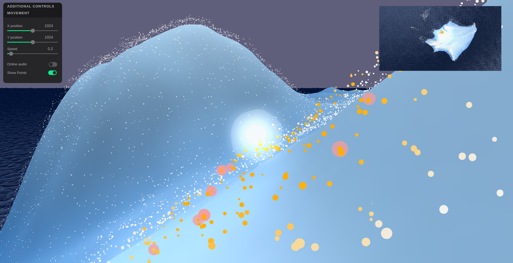

# Re:Discover

This project is part of The Wandering Mind project. Re:Discover is an auditory experience where you can navigate in a virtual world to generate a soundscape. There is a local coherence between the sounds, creating thematic zones recognizable by the human being.

You can use the online version available [here](https://cables.gl/p/MrllSN) or use this repository to connect an AI as a controller or have sound spatialization.

## Installation

### core

Use `pip3 install -r requirements.txt` to install the required python packages.

### audio

Download fmodapi from [drive](https://drive.google.com/file/d/1x6vUOR-Wd_HBsjHQo_IHatQkx6xeQoOR/view?usp=sharing) or from fmod [site](://fmod.com/download)
and unzip at `audio/vendors/fmod`.
Clone [websocketpp](https://github.com/zaphoyd/websocketpp) to `audio/vendors/websocketpp`

Have a csv file of audio chunks info with their file path, chunk id, and spatial coordinates (or embeddings) and put it in `audio/`.

Create a symlink to `audio/mp3` from a folder containning trimmed audio files for the aporee dataset.

Build with `cd audio && make build`

### gui

No installation is required

## Usage

To launch the core of the program, use `make core`

To launch the GUI, use `make gui` and then connect to `localhost:8000` using any browser

To launch the audio software, use `maek audio`

## Acknowledgement

Thanks to Vincent Thevenin who did most of the work related to `audio`.

## References & Related Work

[1]: Freud, S. (1913). The Interpretation of Dreams (Brill, A. A., trans.). 3rd ed. Macmillan.
[2]: Craig, A. D. The sentient self. Brain structure and function 214 (2010): 563-577.
[3]: Dublon, G. (2018). Sensor(y) Landscapes: Technologies for New Perceptual Sensibilities. Doctoral Dissertation, Massachusetts Institute of Technology.
[4]: Grill, J.-B., Strub, F., Altché, F., et al. (2020). Bootstrap Your Own Latent: A New Approach to Self-Supervised Learning. http://arxiv.org/abs/2006.07733
[5]: Haar Horowitz, A., Cunningham, T. J., Maes, P., & Stickgold, R. (2020). Dormio: A targeted dream incubation device. Consciousness and Cognition, 83. https://doi.org/10.1016/j.concog.2020.102938
[6]: Held, R., & Hein, A. (1963). Movement-Produced Stimulation in the Development of Visually Guided Behavior. Journal of Comparative and Physiological Psychology, 56(5), 872–876.
[7]: Mayton, B., Dublon, G., Russell, S., Lynch, E.F., Haddad, D.D.,  Ramasubramanian, V., Duhart, C., Davenport, G., and Paradiso, J. A. (2017). The Networked Sensory Landscape: Capturing and Experiencing Ecological Change Across Scales. Presence: Teleoperators and Virtual Environments, 26(2), MIT Press, 2017.
[8]: Oord, A. van den, Li, Y., & Vinyals, O. (2018). Representation Learning with Contrastive Predictive Coding. http://arxiv.org/abs/1807.03748
